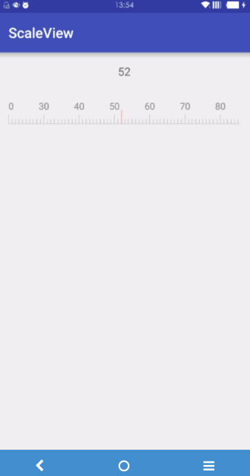

ScaleScrollView
======
 一个动态Draw的滚动刻度尺，目前仅支持水平滚动。
 
 
Usage
-----
1. 在xml布局文件中引入：
```
<com.lichfaker.scaleview.HorizontalScaleScrollView
        android:id="@+id/horizontalScale"
        android:layout_width="wrap_content"
        android:layout_height="wrap_content"
        android:layout_marginTop="10dp"
        app:scale_view_max="200"
        app:scale_view_min="20"
        app:scale_view_height="8dip"
        app:scale_view_margin="5dip"
        />
```

- 目前支持的自定义属性：
 * `scale_view_max` 最大值
 - `scale_view_min` 最小值
 - `scale_view_height` 刻度的高度
 - `scale_view_margin` 刻度的间距
 - `layout_width` 可动态调整

- 获取当前的刻度值
```
scaleScrollView.setOnScrollListener(new OnScrollListener() {
			@Override
			public void onScaleScroll(int scale) {
				mTvHorizontalScale.setText("" + scale);
			}
});
```

Download
----
Gradle：
```
allprojects {
		repositories {
			...
			maven { url "https://jitpack.io" }
		}
}

dependencies {
    compile 'com.github.LichFaker:ScaleView:-SNAPSHOT'
}
```
 

License
--------

    Copyright 2016 LichFaker

    Licensed under the Apache License, Version 2.0 (the "License");
    you may not use this file except in compliance with the License.
    You may obtain a copy of the License at

       http://www.apache.org/licenses/LICENSE-2.0

    Unless required by applicable law or agreed to in writing, software
    distributed under the License is distributed on an "AS IS" BASIS,
    WITHOUT WARRANTIES OR CONDITIONS OF ANY KIND, either express or implied.
    See the License for the specific language governing permissions and
    limitations under the License.

